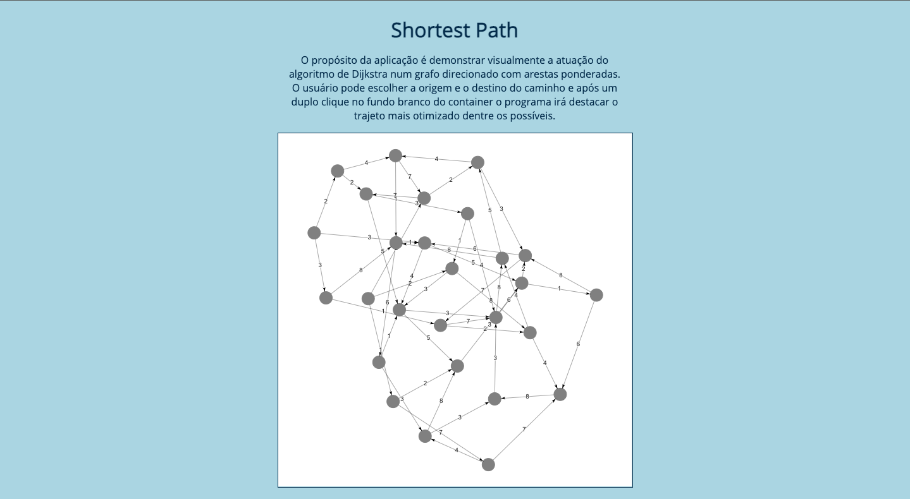
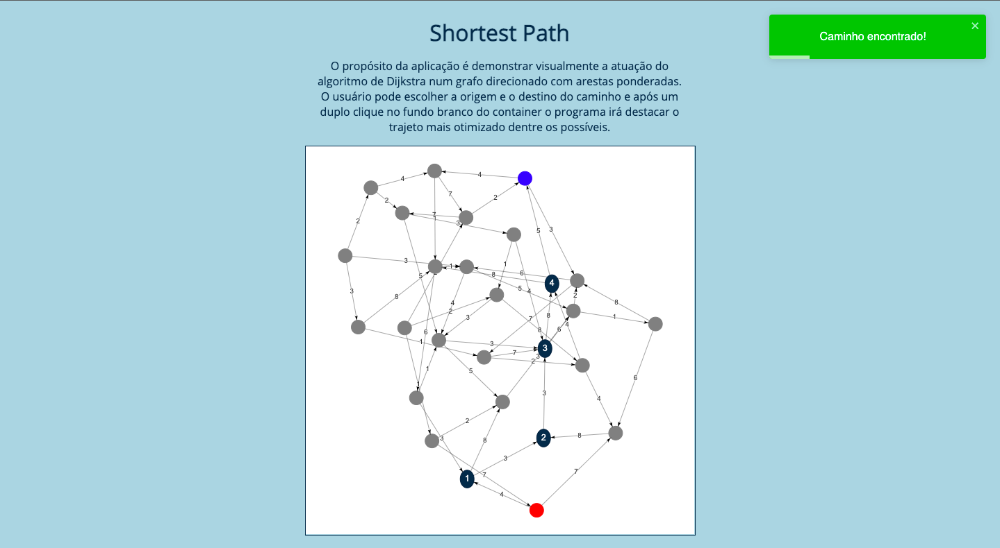
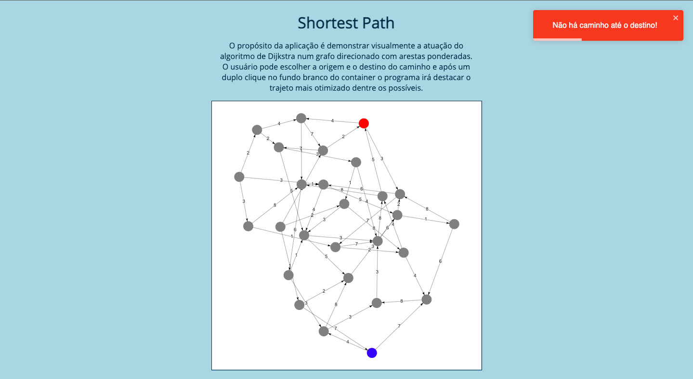

# Grafos 2 - Shortest Path

**Conteúdo da Disciplina**: Grafos 2<br>

## Alunos
|Matrícula | Aluno |
| -- | -- |
| 18/0030345 |  Arthur Sena |
| 18/0033646 |  João Luis Baraky |
## Sobre 
O objetivo do projeto é demonstrar a aplicação do algoritmo de Dijkstra num grafo ordenado com arestas ponderadas, o usuário pode escolher origem e destino no grafo e rodar a aplicação para que o menor trajeto se destaque na tela.
## Screenshots





## Instalação 
**Linguagem**: JavaScript<br>
**Framework**: React<br>

```
# Após clonar a aplicação e entrar no diretório da aplicação basta instalar as dependências,

npm install

# rodar a aplicação
npm start

# e navegar até o endereço localhost:3000 no seu navegador.
```

## Uso 
Para utilizar a aplicação basta clicar no grafo de origem e no de destino para selecioná-los (se destacarão em vermelho e azul, respectivamente) e clicar duas vezes no fundo branco do container do grafo para visualizar o menor trajeto ser destacado, para usar novamente basta recomeçar o processo.
